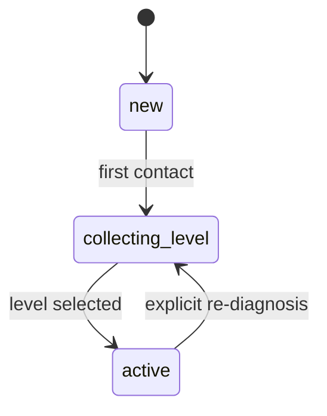
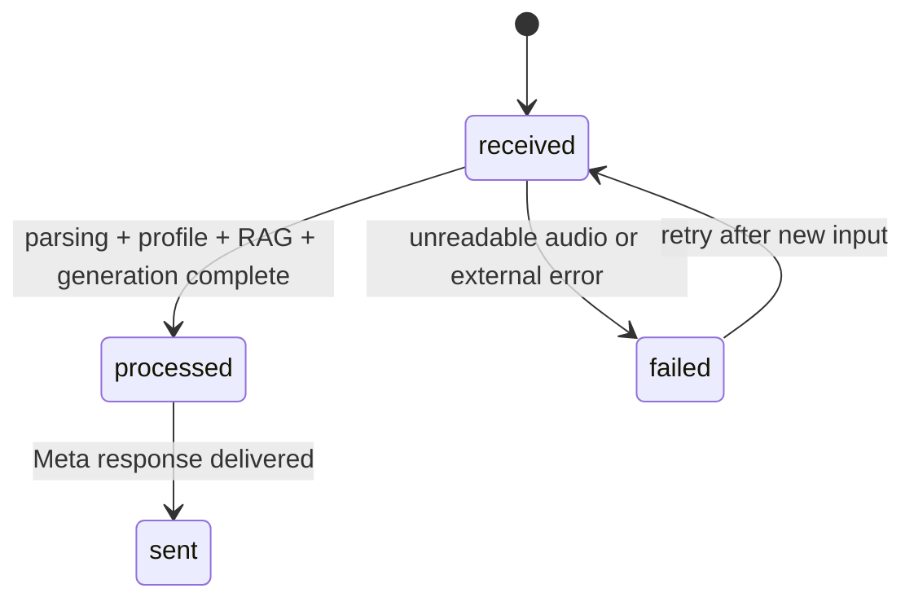

# Data Model: Alfabot Marajoara

## Entities

### LearnerProfile
Represents a student identity linked to a WhatsApp phone number.

**Fields**
- `id`: internal identifier
- `phone_number`: unique WhatsApp sender number
- `pedagogical_level`: `new`, `iniciante`, `basico`, `intermediario`
- `onboarding_state`: `new`, `collecting_level`, `active`
- `display_name`: optional human-readable name
- `created_at`: creation timestamp
- `updated_at`: last modification timestamp
- `last_seen_at`: last inbound interaction timestamp

**Validation Rules**
- `phone_number` must be unique and non-empty.
- `pedagogical_level` must be one of the supported values.
- `onboarding_state` must only move forward unless reset by an explicit re-diagnosis.

### InteractionRecord
Represents a single inbound or outbound conversational turn.

**Fields**
- `id`: internal identifier
- `profile_id`: foreign key to `LearnerProfile`
- `direction`: `inbound` or `outbound`
- `message_type`: `text`, `audio`, `interactive`, `system`
- `raw_payload`: stored webhook payload or outbound payload snapshot
- `transcript_text`: text extracted from audio when available
- `prompt_text`: assembled prompt sent to the local model
- `response_text`: final reply sent to the learner
- `status`: `received`, `processed`, `failed`, `sent`
- `error_code`: optional failure classification
- `created_at`: timestamp

**Relationships**
- Many `InteractionRecord` rows belong to one `LearnerProfile`.
- One interaction may reference zero or one audio artifact in local storage.

### KnowledgeChunk
Represents a local cultural knowledge fragment stored for retrieval.

**Fields**
- `id`: internal identifier
- `source_title`: source name or content title
- `chunk_text`: normalized content text
- `topic_tags`: optional tags such as fauna, flora, lenda, cultura
- `embedding_key`: Chroma identifier for the stored vector
- `language`: language code or locale tag
- `created_at`: timestamp

**Relationships**
- ChromaDB stores the vector representation for each chunk.
- SQLite stores the metadata catalog for traceability and refresh operations.

### MediaArtifact
Represents a downloaded audio file from the Meta media endpoint.

**Fields**
- `id`: internal identifier
- `profile_id`: foreign key to `LearnerProfile`
- `source_media_id`: Meta media identifier
- `local_path`: file path to the downloaded artifact
- `mime_type`: expected media type
- `transcription_status`: `pending`, `done`, `failed`, `retry_requested`
- `created_at`: timestamp

**Validation Rules**
- The local file path must point to a runtime-managed directory.
- A failed or unreadable media artifact must not be treated as a valid transcript.

## State Transitions

### Learner onboarding

### Interaction processing

